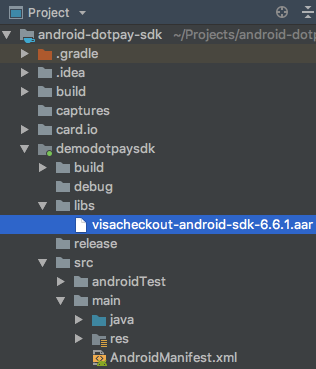

# Mobile Dotpay SDK for Android


SDK (Android) Version 1.4.18

## Compile

To use this library, you need to edit your .gradle files AND integrate Visa Checkout SDK:

### Gradle

Add this to your build.gradle files:

```gradle
// Project build.gradle
allprojects {
    repositories {
        maven { url 'https://github.com/dotpay/Mobile-SDK-Android/raw/master/' }
    }
    flatDir {
        dirs 'libs'
    }
}

// Module build.gradle
dependencies {

    // needed to compile Visa Checkout .aar
    implementation fileTree(include: ['*.jar', '*.aar'], dir: 'libs')
    
    // Standard Dotpay SDK version
    implementation('pl.mobiltek.paymentsmobile:dotpay:1.4.18@aar') {
        transitive = true
    }
    
    // OR
  
    // Dotpay SDK with Google Pay integration
    implementation('pl.mobiltek.paymentsmobile:dotpay-googlepay:1.4.18@aar') {
        transitive = true
    }
}
```

In your AndroidManifest.xml file:

```xml
<application
        ...
        tools:replace="android:allowBackup"
        ...
```


### Visa Checkout SDK

This library uses Visa Checkout SDK. It is not distributed as a gradle dependency, therefore you have to add it as external library by yourself.

Please use corresponding version according to your Dotpay SDK version as in table below.

| Dotpay SDK version  | Visa Checkout SDK version |
| ------------------- | ------------------------- |
| 1.4.14+  | 6.6.1  |

You can download your Visa Checkout SDK .aar file from 'visa_checkout_sdk' directory of this repository.

Change 'Android' to 'Project' View in Android Studio, and put library in 'libs' directory (create it if needed) like in image below.


